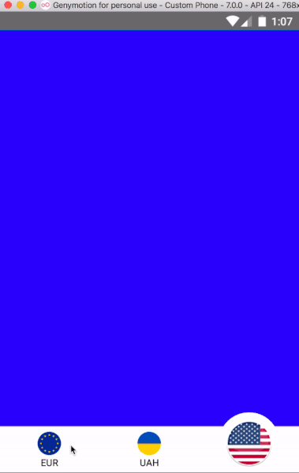

# react-native-tab-bar-footer
[](https://npmjs.org/package/react-native-tab-bar-footer "View this project on npm")
[](https://npmjs.org/package/react-native-tab-bar-footer "View this project on npm")

Navigation TabBar footer component for IOS and Android with slide animation which contains tab icon and title.

## Installation
`yarn add react-native-tab-bar-footer`




# Usage

```js

import TabBar from 'react-native-tab-bar-footer'
...
  const tabs = [
    {
      icon: star,
      activeIcon: starActive,
      title: 'Favorites'
    },
    {
      icon: play,
      activeIcon: playActive,
      title: 'Play'
    },
    {
      icon: user,
      activeIcon: userActive,
      title: 'Profile'
      
    },
  ]
  render() {
    return <TabBar onTabChange={(index) => alert(index)} tabs={tabs} />
  }
```

## Props

| Prop  | Default  | Type | Description |
| :------------ |:---------------:| :---------------:| :-----|
| tabs | [] | `array` | Tabs objects with structure: { icon: string|Object, activeIcon: string|Object, title: string}  |
| onTabChange | undefined | `func` | onClick tab |
| slideSpeed | 20 | `number` | tabBar animation speed |
| slideBounciness | 12 | `number` | tabBar bounciness |
| tabSize | 30 | `number` | tab size |
| barColor | 'white' | `color` | tabBar color |
| height | 60 | `number` | tabBar height |
| titleStyle | - | `style` | title custom style |
| iconStyle | - | `style` | icon custom style |
| animationDuration | 300 | `number` | animation duration |


## Questions or suggestions?

Feel free to [open an issue](https://github.com/ArtemKosiakevych/react-native-tab-bar-footer/issues)
